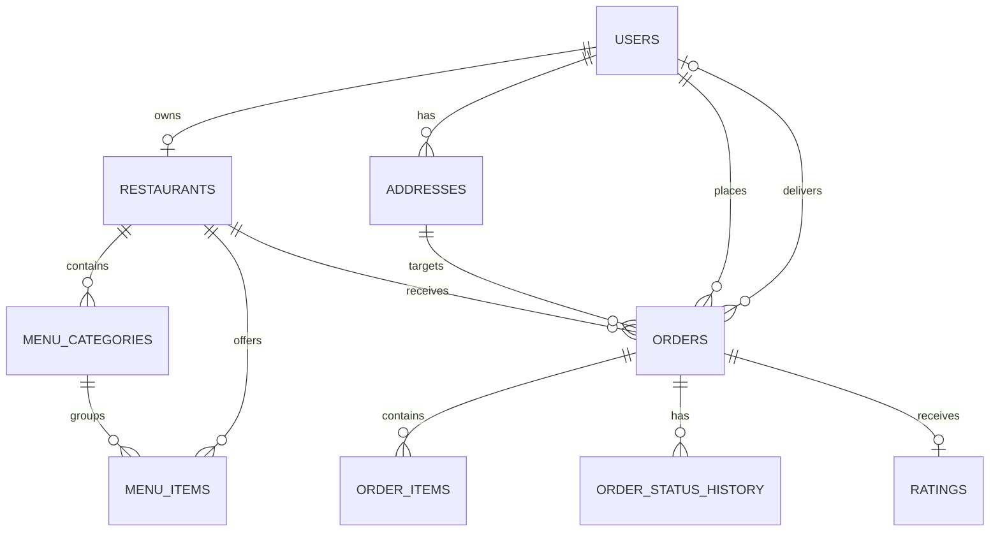
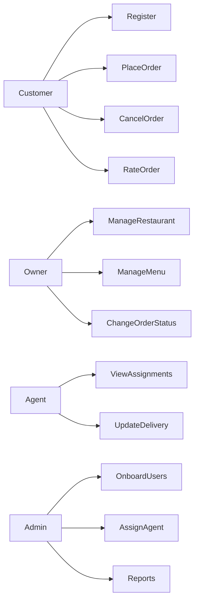

# Architecture

## ER diagram

```mermaid
erDiagram
    USERS ||--o| RESTAURANTS : owns
    USERS ||--o{ ADDRESSES : has
    RESTAURANTS ||--o{ MENU_CATEGORIES : contains
    RESTAURANTS ||--o{ MENU_ITEMS : offers
    MENU_CATEGORIES ||--o{ MENU_ITEMS : groups
    USERS ||--o{ ORDERS : places
    RESTAURANTS ||--o{ ORDERS : receives
    ADDRESSES ||--o{ ORDERS : targets
    USERS o|--o{ ORDERS : delivers
    ORDERS ||--o{ ORDER_ITEMS : contains
    ORDERS ||--o{ ORDER_STATUS_HISTORY : has
    ORDERS ||--o| RATINGS : receives
```

## Use-case diagram

```mermaid
flowchart LR
    Customer --> Register
    Customer --> PlaceOrder
    Customer --> CancelOrder
    Customer --> RateOrder
    Owner --> ManageRestaurant
    Owner --> ManageMenu
    Owner --> ChangeOrderStatus
    Agent --> ViewAssignments
    Agent --> UpdateDelivery
    Admin --> OnboardUsers
    Admin --> AssignAgent
    Admin --> Reports
```
